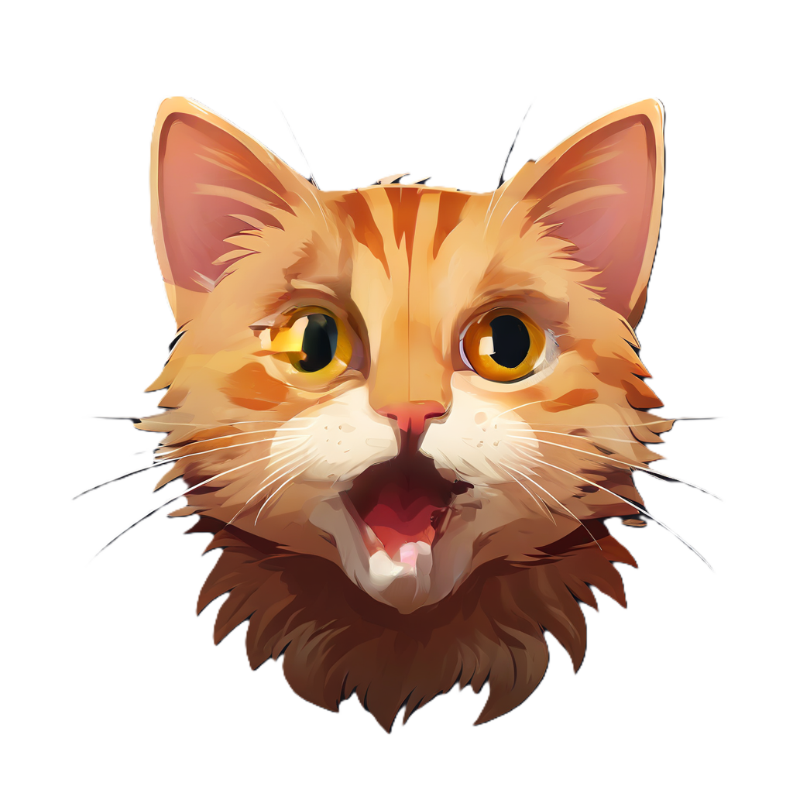

# KatBox

试图使用Compose Multiplatform实现一个AI聊天界面。

# 项目名称

这是一个尝试使用[Compose Multiplatform](https://github.com/JetBrains/compose-multiplatform)模仿[ChatBox](https://github.com/chatboxai/chatbox)的项目，现在还是一个toy project。改C为K也是Kotlin项目命名的传统了，而Cat很可爱是选择这个名字的重要理由。

图标是AI生成的。

# 当前进展

- [x] 连接Ollama并列出模型
- [x] 与模型正确流式对话
- [ ] 连接其他提供者，并记住API Key
- [x] 会话内容Markdown解析
- [ ] 记住会话历史
- [ ] 提示词模板